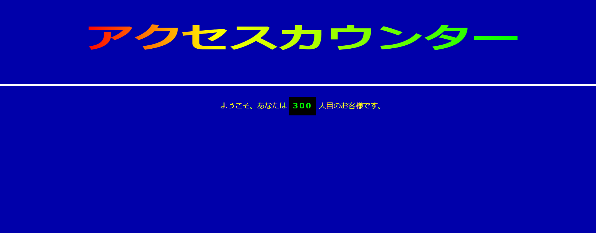
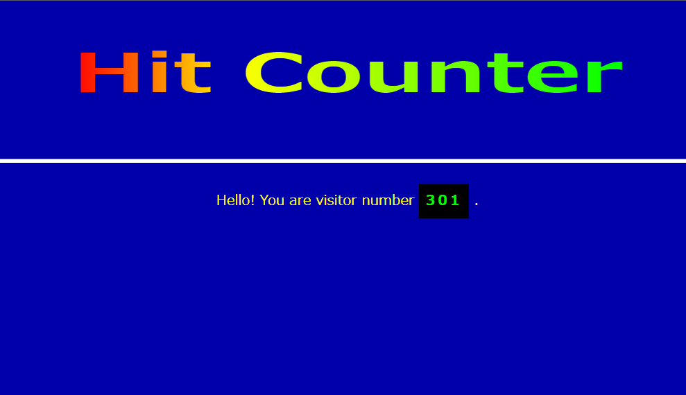

# WCGI Access Counter

[](https://github.com/Syuparn/wcgi-access-counter/actions/workflows/ci.yml)
[](https://wapm.io/Syuparn/wcgi-access-counter)

## About

This is an access counter (aka hit counter) CGI written in WebAssembly.

```console
$ curl localhost:8000
{"pageviews": 1}
$ curl localhost:8000
{"pageviews": 2}
```

You can call it from your websites!





## Getting Started

You need Wasmer and WAPM to run the counter.

```console
# install Wasmer
$ curl https://get.wasmer.io -sSfL | sh

# install this project via wapm
$ wapm install Syuparn/wcgi-access-counter
$ cd wapm_packages/Syuparn/wcgi-access-counter@${VERSION}

# run counter cgi
$ wasmer run-unstable --mapdir /tmp/counter:$(pwd)/counter --env SERVER_PROTOCOL=HTTP/1.1 --env SCRIPT_NAME=pageviews --env REQUEST_METHOD=GET .
```

Then the cgi can be called from `localhost:8000`.

```console
$ curl localhost:8000
{"pageviews": 1}
$ curl localhost:8000
{"pageviews": 2}
```

Also, HTML files of sample pages shown above are in `/frontend`.

Views information is recorded in `counter/counter.txt`. You can reset it manually.

```console
$ echo -n 0 > counter/counter.txt
```

### Build from source codes

You need Rust, Cargo, and rustup.

```console
# install wasm32-wasi target
$ rustup target add wasm32-wasi

# build wasm
$ cargo build --target=wasm32-wasi --release

# create counter file to record views
$ mkdir -p counter && echo -n 0 > counter/counter.txt
```

## License

This project is generated from https://github.com/wasmerio/wcgi-rust-template.

This is licensed under either of

- Apache License, Version 2.0, ([LICENSE-APACHE](./LICENSE-APACHE.md) or
  <http://www.apache.org/licenses/LICENSE-2.0>)
- MIT license ([LICENSE-MIT](./LICENSE-MIT.md) or
   <http://opensource.org/licenses/MIT>)

at your option.

It is recommended to always use [`cargo crev`][crev] to verify the
trustworthiness of each of your dependencies, including this one.

## Development

Lint

```console
$ rustup component add clippy
$ cargo clippy
```
